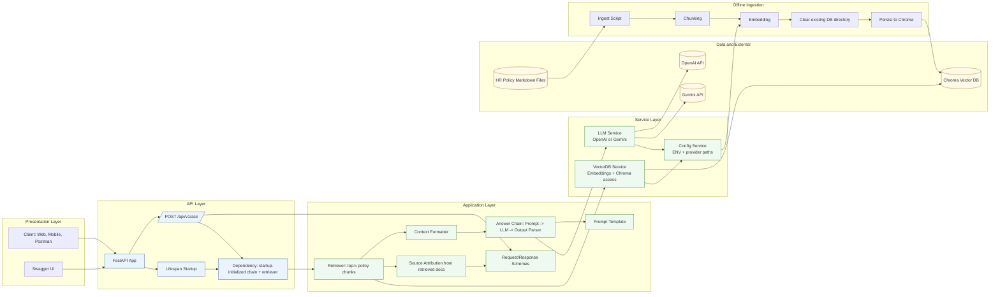

```mermaid
flowchart LR
  subgraph A[Presentation Layer]
    C[Client: Web, Mobile, Postman]
    SW[Swagger UI]
  end

  subgraph B[API Layer]
    APP[FastAPI App]
    LIFE[Lifespan Startup]
    ASK[/POST /api/v1/ask/]
    DEP[Dependency: startup-initialized chain + retriever]
  end

  subgraph C1[Application Layer]
    RETRIEVE[Retriever: top-k policy chunks]
    FORMAT[Context Formatter]
    CHAIN[Answer Chain: Prompt -> LLM -> Output Parser]
    SOURCE[Source Attribution from retrieved docs]
    PROMPT[Prompt Template]
    SCHEMA[Request/Response Schemas]
  end

  subgraph D[Service Layer]
    LLM[LLM Service\nOpenAI or Gemini]
    VEC[VectorDB Service\nEmbeddings + Chroma access]
    CFG[Config Service\nENV + provider paths]
  end

  subgraph E[Data and External]
    CHROMA[(Chroma Vector DB)]
    POLICIES[(HR Policy Markdown Files)]
    OAI[(OpenAI API)]
    GEM[(Gemini API)]
  end

  subgraph F[Offline Ingestion]
    ING[Ingest Script]
    SPLIT[Chunking]
    EMBED[Embedding]
    RESET[Clear existing DB directory]
    SAVE[Persist to Chroma]
  end

  C --> APP --> ASK
  SW --> APP
  APP --> LIFE --> DEP
  ASK --> SCHEMA
  ASK --> DEP --> RETRIEVE
  RETRIEVE --> FORMAT --> CHAIN
  RETRIEVE --> SOURCE
  CHAIN --> PROMPT
  RETRIEVE --> VEC --> CHROMA
  CHAIN --> LLM
  LLM --> OAI
  LLM --> GEM
  LLM --> CFG
  VEC --> CFG

  POLICIES --> ING --> SPLIT --> EMBED --> RESET --> SAVE --> CHROMA
  CFG --> EMBED
  SOURCE --> SCHEMA

  classDef api fill:#eaf4ff,stroke:#1f5aa6,stroke-width:1px;
  classDef app fill:#eefaf0,stroke:#2e7d32,stroke-width:1px;
  classDef data fill:#fff9e8,stroke:#9a6b00,stroke-width:1px;
  class APP,LIFE,ASK,DEP api;
  class RETRIEVE,FORMAT,CHAIN,SOURCE,PROMPT,SCHEMA,LLM,VEC,CFG app;
  class CHROMA,POLICIES,OAI,GEM data;
```
